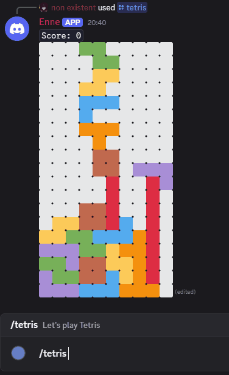
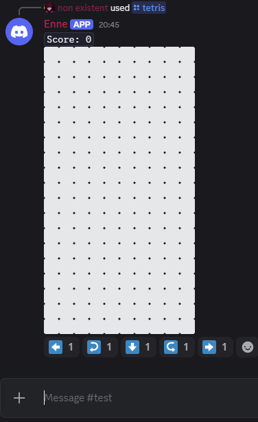
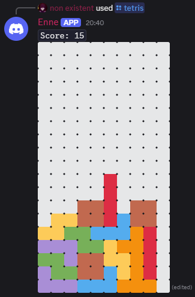
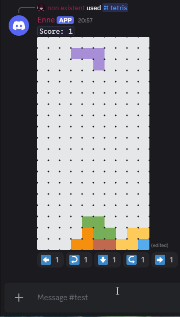
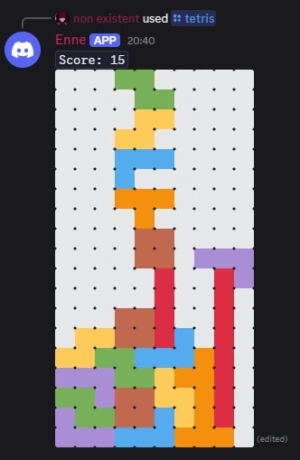

# Discord Tetris Bot

An interactive Discord bot that brings the classic Tetris game directly into Discord text channels, allowing users to play through reaction-based controls.



*Live gameplay showing piece movement, rotation, and line clearing*

---

## Table of Contents
- [Overview](#overview)
- [Features](#features)
- [Demo](#demo)
- [Installation & Usage](#installation--usage)
- [Commands](#commands)
- [Technologies Used](#technologies-used)
- [Technical Challenges](#technical-challenges)

---

## Overview

This Discord bot transforms any text channel into an interactive Tetris game, leveraging Discord's reaction system for real-time gameplay. Players control falling tetrominos using emoji reactions while the bot updates the game board dynamically in a single message.

### Key Achievements
- Implemented full Tetris game logic from scratch in Python
- Designed reaction-based control system working within Discord's API constraints
- Built real-time message editing system for smooth visual updates

---

## Features

### Core Gameplay
- **Classic Tetris Mechanics**: Standard 7-piece tetromino system
- **Full Game Rules**: Line clearing, scoring, and game over detection
- **Reaction Controls**: Use emoji reactions to move, rotate, and drop pieces
- **Real-time Board Updates**: Game state rendered as Emoji art in Discord messages

### Game Features
- **Live Board Rendering**: Visual game board updated through message edits
- **Score Tracking**: Points awarded for line clears with combo multipliers
- **Progressive Difficulty**: Increasing speed as you clear more lines
- **Next Piece Preview**: See upcoming tetromino to plan ahead

---

## Demo

### Starting a Game


*Using `/tetris` command to initiate a new game*

### Active Gameplay


*Game board with reaction controls and current piece*

The game board renders directly in Discord with emoji reactions serving as controls. Players interact with the game by clicking the reaction buttons below the game board.

### Line Clear


*Visual feedback when completing and clearing lines*

### Game Over State


*Final score display when game ends*

### Features in Action
- **Reaction Controls**: Players add reactions to control their pieces in real-time
- **Message Updates**: Board refreshes in place as game progresses
- **Line Clears**: Visual feedback when rows are completed with score updates
- **Score Tracking**: Live score updates throughout gameplay

---

## Installation & Usage

### Prerequisites
- Python 3.8 or higher
- [uv](https://docs.astral.sh/uv/) (Python package manager)
- Discord Bot Token ([Create one here](https://discord.com/developers/applications))

### Setup

1. **Install dependencies:**
   ```bash
   uv sync
   ```
   *Don't have uv? [Install it here](https://docs.astral.sh/uv/getting-started/installation/)*

2. **Configure bot token:**
   Create a `.env` file:
   ```env
   TOKEN=your_discord_bot_token_here
   ```

3. **Run the bot:**
   ```bash
   uv run python main.py
   ```

4. **Invite to your server:**
   - [Create a bot application](https://discord.com/developers/applications)
   - [Follow Discord's setup guide](https://discord.com/developers/docs/quick-start/getting-started#installing-your-app)

---

## Commands

| Command | Description | Usage |
|---------|-------------|-------|
| `/tetris` | Start a new Tetris game | Type `/tetris` in any channel the bot can access |

### In-Game Controls
Once the game starts, control your pieces using these reactions:
- ⬅️ **Move Left**: Shift piece left
- ➡️ **Move Right**: Shift piece right
- ⬇️ **Drop**: Drop piece down
- ↩️ **Rotate Clockwise**: Rotate piece clockwise
- ↪️ **Rotate Anti-Clockwise**: Rotate piece anti-clockwise

---

## Technologies Used

**Core:**
- Python 3.8+
- discord.py (Discord API wrapper)
- Discord Slash Commands

**Libraries:**
- `python-dotenv` (Environment management)
- `asyncio` (Asynchronous game loop)

**Architecture:**
- Event-driven design for reaction handling
- Asynchronous message editing for real-time updates

---

## Technical Challenges

### Discord API Rate Limiting
**Challenge:** Discord imposes strict rate limits on message edits (5 edits per 5 seconds), which makes gameplay feel sluggish.

### Reaction-Based Input
**Challenge:** Discord reactions aren't designed for real-time game controls. Detecting and processing reactions introduces latency.

**Solution:** Built an event queue system that processes reactions efficiently while providing visual feedback to confirm input registration.

---
